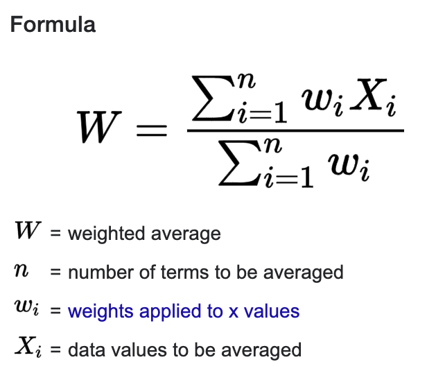

# CP - Wild Pig Management at JLDP
This repo contains data cleaning, wrangling, and analysis scripts for N-mixture modeling, spatial interpolation, and pig occurrence analysis. 

### File structure:

- `00_pig_occurrence_per_episode.Rmd`: transforms tabular output from Timelapse2 to the number of occurrences in each episode. The output file `pig_occurrence_per_episode.csv` in `cleaned_data/` is used in `02_cleaning_spatial_data.Rmd` to filter cameras that had records of wild pigs during the period of study

- `01_model/`: contains scripts that outputs the N-mixture modeling results of estimated wild pig population abundance at each camera site in given time period

  - `00_cleaning_camera_trap_pig_count.R`: clean tabular output from Timelapse2 to number of groups per day (`scratch/NumGroupPerDay.csv`), group sizes (`scratch/PigGroupSize.csv`) and a full summary of wild pig groups (`scratch/pig_episode_full_summary.csv`)

  - `01_n_mixture_model_by_group.R`: script for N-mixture model on the number of groups of wild pigs. Outputs are in `output/NumGroupPerStatn/`

  - `02_number_of_groups_to_abundance.R`: transform the estimated number of groups into abundance using the weighted average of group size. The weighted average of group size used the probability distribution of group size over all camera stations and group size observed at each camera station to find the weighted average

     [image cite](https://www.statisticshowto.com/weighted-mean/#:~:text=Weighted%20mean%20%3D%20%CE%A3wx%2F%CE%A3w&text=w%20%3D%20the%20weights.,x%20%3D%20the%20value.)

  - `html/`: contains HTML outputs

  - `input/`: contains input data (i.e. raw data)

  - `model.html`: knitted html from `model.Rmd`

  - `model.R`: creates HTML report for the analysis in addition to tabular outputs in CSV format

  - `model.Rmd`: uses **knit**  to creates tabular outputs in CSV format by running the three R scripts (i.e. `00_cleaning_camera_trap_pig_count.R`, `01_n_mixture_model_by_group.R`, and `02_number_of_groups_to_abundance.R`) given the parameters defined in `parameters.R`

  - `model.Rproj`: R project for this `model/` folder

  - `output/`: contains outputs of the estimated number of pig groups at each camera trap station (`NumGroupPerStatn/`) from N-mixture model and estimated pig abundance at each camera site (`SiteAbundance/`)

  - `parameters.R`: set parameters involved in this analysis, including the raw data. Important and useful parameters are listed below:

    - `begin_visit` and `end_visit`: defines the time period of N-mixture modeling
      - The data we used in this analysis ranges from 2013-10-01 to 2014-09-30. You can pick any date in between for analysis following the format `xyyyy_mm_dd`
      - The April check in our analysis is defined from `begin_visit = "x2013_10_23"` to `end_visit = "x2014_04_22"`. The September check in our analysis is defined from `begin_visit = "x2014_04_24"` to `end_visit = "x2014_09_25"`
    - `name_analysis_n_mixture`: names the current run of analysis (e.g. `"April"`, `"Septmber"`)

  - `scratch/`: contains secondary data output

- `02_cleaning_spatial_data.Rmd`: cleans the raw data of camera trap stations by removing duplicates and filtering out stations that were not used in the study; creates maps of the locations of camera stations which are store in `figure/location/`; transform tabular data of pig abundance in `01_model/output/SiteAbundance/` into spatial data and stored in `cleaned_data/`
- `03_spatial_interpolation_pig_abundance.Rmd`: creates pig abundance heatmaps and other analysis outputs using spatial interpolation; all analysis outputs are stored in `figure/abundance/` as figures in PNG format; abundance heatmaps made by kriging are also stored in GeoTIF in `output_data/abundance`
- `cleaned_data`: contains secondary data
- `CP-WildPigManagement.Rproj`: R project at the base of the repo
- `figure`: contains figure outputs from analysis
  - `abundance/`: contains spatial interpolation outputs of pig abundance
    - `april/`: results for April Check
    - `september/`: results for September Check
  - `location/`: contains maps for camera trap locations for both April and September Check
- `image`: contains image used in this `README.md`
- `output_data/`: contains important outputs 
  - `abundance/`: contains heatmaps of pig abundance in GeoTIF format created by kriging
- `raw_data/`: contains raw data used in the analysis
- `README.md`: this file

### Usage

1. Run `00_pig_occurrence_per_episode.Rmd`

2. Set parameters in `01_model/parameters.R`. **Run** `model.R` or **knit** `model.Rmd`
   1. Outputs of estimated pig abundance at each camera trap station in `html/` in HTML and/or `output/` in CSV
3. Run `02_cleaning_spatial_data.Rmd`
   1. Outputs of camera trap stations in `figure/location/`
4. Run `03_spatial_interpolation_pig_abundance.Rmd` 
   1. Outputs of spatial interpolation in `figure/abundance/` in PNG and `output_data/abundance/` in GeoTIF

